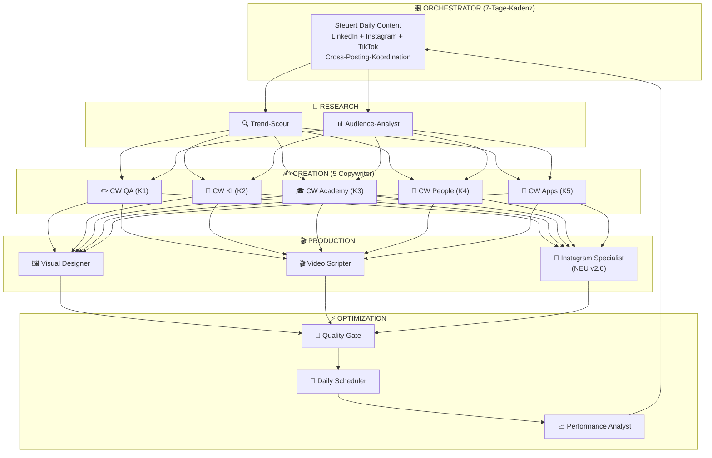

# WAMOCON Marketing-Maschine — Master-Strategie v2.0

> **Version:** 2.0 | **Stand:** 27.06.2026  
> **Auftraggeber:** WAMOCON GmbH, Eschborn  
> **Strategie-Framework:** 80/20-Pareto × Top-5%-Performer × Daily-Posting  
> **Primärfokus:** Organische Reichweite — **LinkedIn + Instagram gleichberechtigt**

---

## Änderungen gegenüber v1.0

> [!IMPORTANT]
> **Drei fundamentale Upgrades in v2.0:**
> 1. **Instagram wird zum gleichberechtigten Hauptkanal** neben LinkedIn (vorher: Sekundärkanal nur für K3/K4)
> 2. **Tägliche Posting-Frequenz**: Minimum 1 Post/Tag auf jeder aktiven Plattform (vorher: 5/Woche LinkedIn)
> 3. **Alle 5 Kampagnen spielen auf Instagram** (vorher: nur K3 + K4)

---

## 1. Aktualisiertes Kampagnen-Mapping (umgesetzt in JSONs)

### 1.1 Kampagnen-Kanäle (SOLL = IST nach Update)

| Kampagne | LinkedIn | Instagram | TikTok | YouTube | Fach-Blogs | Sonstige |
|---|:---:|:---:|:---:|:---:|:---:|:---:|
| K1 — QA-Consulting | ✅ | ✅ **NEU** | ◌ | ◌ | ✅ | Webinare, Newsletter |
| K2 — KI Sokrates | ✅ | ✅ **NEU** | ◌ | ◌ | ◌ | Wirtschaftsmagazine, Direct-Mailing |
| K3 — LFA Azubis | ✅ | ✅ | ✅ | ◌ | ◌ | Azubi-Messen |
| K4 — Mitarbeiter | ✅ | ✅ | ◌ | ✅ | ◌ | Karriere-Website |
| K5 — App-Entwicklung | ✅ | ✅ **NEU** | ◌ | ✅ | ✅ | Website |

### 1.2 Zielgruppen-Mapping (SOLL = IST nach Update)

| Zielgruppe | K1 QA | K2 Sokrates | K3 LFA | K4 Mitarbeiter | K5 Apps |
|---|:---:|:---:|:---:|:---:|:---:|
| Z1 Thomas (IT-Leiter) | ✅ | ✅ | ✅ | ✅ | ✅ |
| Z2 Sarah (Recruiterin) | ✅ | ◌ | ✅ | ✅ | ◌ |
| Z3 Lukas (QA-Engineer) | ✅ | ✅ **NEU** | ◌ | ✅ | ◌ |
| Z4 Leon (Azubi) | ◌ | ◌ | ✅ | ✅ **NEU** | ◌ |
| Z5 Markus (GF/CEO) | ✅ **NEU** | ✅ | ◌ | ◌ | ✅ |

> Alle Änderungen wurden in die JSON-Dateien geschrieben: [K1](file:///d:/Testprojekt/WAMOCON_Marketingmaschine/Kampagnen/kampagne_1_consulting_qa.json), [K2](file:///d:/Testprojekt/WAMOCON_Marketingmaschine/Kampagnen/kampagne_2_ki_sokrates.json), [K4](file:///d:/Testprojekt/WAMOCON_Marketingmaschine/Kampagnen/kampagne_4_mitarbeiter.json), [K5](file:///d:/Testprojekt/WAMOCON_Marketingmaschine/Kampagnen/kampagne_5_app_entwicklung.json).

---

## 2. Instagram-Strategie: Der gleichberechtigte Hauptkanal

### 2.1 Warum Instagram jetzt Hauptkanal ist

| Argument | Daten |
|---|---|
| **B2B auf Instagram wächst explosiv** | 71% der B2B-Entscheider im DACH-Raum nutzen Instagram privat — und nehmen dort Markeneindrücke mit in ihre Kaufentscheidung (HubSpot 2025). |
| **Employer Branding #1** | Instagram ist der stärkste Kanal für Employer Branding bei 16-35-Jährigen. Für K3 (Azubis) und K4 (Mitarbeiter) unverzichtbar. |
| **Reels-Algorithmus bevorzugt kleine Accounts** | Instagram Reels haben eine überproportionale organische Reichweite für Accounts <10k Follower — idealer Zeitpunkt zum Starten. |
| **Visueller Proof of Execution** | WAMOCONs 50 Apps sind perfekt für visuelles Storytelling (App-Screenshots, Demo-Clips, Before/After). |
| **Cross-Posting-Effizienz** | LinkedIn-Carousels → Instagram-Carousels mit minimalem Adaptionsaufwand. |

### 2.2 Instagram-Content-Säulen (5 Kampagnen × Instagram-native Formate)

| Content-Säule | Kampagne | Format | Frequenz | Beispiel |
|---|---|---|:---:|---|
| **QA-Wissen kompakt** | K1 | Carousel (10 Slides) | 2x/Woche | "5 Fehler, die jeder Junior-Tester macht" |
| **KI entmystifiziert** | K2 | Reel (30-60s) | 2x/Woche | "Was ist LLM-as-a-Judge? In 45 Sekunden erklärt." |
| **Azubi-Leben real** | K3 | Reel + Story | Täglich | "POV: Dein erster Code-Review bei WAMOCON" |
| **Team-Spotlight** | K4 | Carousel + Story | 2x/Woche | "3 Fragen an Sarah, unsere Senior Testerin" |
| **App der Woche** | K5 | Reel (App-Demo) | 1x/Woche | "Diese App spart Arztpraxen 3h/Tag — so funktioniert ARIA" |
| **Behind the Scenes** | K3+K4 | Story (5-8 Slides) | Täglich | Office-Tour, Coding-Session, Team-Lunch |
| **Community-Engagement** | Alle | Polls, Q&A, Quiz | 3x/Woche | "Was nervt euch am meisten beim Testing? 🗳️" |

### 2.3 Instagram-Algorithmus-Taktiken (Top 5%)

| Taktik | Implementierung |
|---|---|
| **Reel-Hook in 1.5s** | Erste 1.5 Sekunden entscheiden. Text-Overlay + starke visuelle Bewegung sofort. |
| **Carousel-Engagement** | Slide 1 = Hook (Swipe-Trigger), letzte Slide = "Speichern für später 🔖" → Save-Rate steigert Reichweite massiv. |
| **Story-Sticker-Strategie** | Jede Story enthält 1 interaktives Element: Poll, Quiz, Slider, Frage-Box → Algorithmus-Boost durch Interaktion. |
| **Hashtag-Cluster (3 Ebenen)** | 5 Nischen-Tags (#SAPTesting, #ISTQB), 5 Mittel (#QualityAssurance, #ITKarriere), 3 Breit (#TechLife, #CodingLife, #KI) |
| **Posting-Zeit Instagram DACH** | Feed: 11:00-13:00 (Mittagspause-Scroll). Reels: 18:00-20:00 (Feierabend). Stories: 07:30-08:30 + 20:00-21:00. |
| **Carousels > Single Images** | Carousels bekommen 1.4x mehr Reichweite als Single-Image-Posts (Instagram-Algorithmus belohnt Dwell Time). |

### 2.4 Instagram-Hashtag-Strategie

| Cluster | Hashtags | Kampagnen |
|---|---|---|
| **QA/Testing** | #Softwaretesting #Testautomatisierung #ISTQB #QualityAssurance #SAPTesting #Testmanagement #AgileTesting | K1 |
| **KI/Digitalisierung** | #KünstlicheIntelligenz #KIimMittelstand #Digitalisierung #Automatisierung #Datensouveränität #AIforBusiness | K2 |
| **Ausbildung/Karriere** | #Fachinformatiker #FIAE #ITAusbildung #Azubi2026 #CodingLife #Ausbildung #ITKarriere | K3, K4 |
| **App-Entwicklung** | #AppDevelopment #MadeInGermany #SaaS #Softwareentwicklung #TechStartup #AppDesign | K5 |
| **Employer Branding** | #TeamWAMOCON #LifeAtWAMOCON #ITJobs #BehindTheScenes #WorkCulture #TechTeam | K4 |
| **Breit/Discovery** | #TechLife #Coding #Developer #Innovation #Frankfurt #Eschborn | Alle |

---

## 3. Tägliche Posting-Frequenz: Der neue Standard

### 3.1 Posting-Kadenz pro Plattform (v2.0)

| Plattform | v1.0 (alt) | v2.0 (neu) | Steigerung |
|---|---|---|---|
| **LinkedIn** | 5 Posts/Woche | **7 Posts/Woche** (1/Tag) | +40% |
| **Instagram Feed** | Nicht systematisch | **7 Posts/Woche** (1/Tag) | NEU |
| **Instagram Stories** | Nicht systematisch | **Täglich** (3-5 Slides) | NEU |
| **Instagram Reels** | 0 | **4-5 Reels/Woche** | NEU |
| **TikTok** | 3-5 Reels/Woche | **5 Reels/Woche** | Bestätigt |
| **YouTube** | 1/Woche | **1/Woche** | Bestätigt |
| **Gesamt-Output** | ~40 Pieces/Monat | **60-70 Pieces/Monat** | +65% |

### 3.2 Wöchentlicher Content-Verteilungsplan

| Tag | LinkedIn (07:30 oder 12:00) | Instagram Feed (12:00) | Instagram Story (07:30 + 20:00) | Instagram Reel (18:30) | TikTok (19:00) |
|---|---|---|---|---|---|
| **Montag** | K1: QA-Carousel | K5: App-Spotlight Carousel | K3: Azubi Morning + Evening | K3: Azubi-Reel | K3: Azubi-Reel (Repost) |
| **Dienstag** | K2: KI Sokrates Post | K1: QA-Wissen Carousel | K4: Team Behind-the-Scenes | K2: KI erklärt in 45s | K2: KI-Reel (Repost) |
| **Mittwoch** | K5: App-Spotlight Thread | K4: Team-Spotlight Carousel | K3: Code & Coffee Story | K5: App-Demo Reel | K3: Coding-Session Reel |
| **Donnerstag** | K4: Talking-Head Video | K2: KI-Infografik Carousel | K4: Interview-Snippet Story | K3: Erwartung vs. Realität | K3: Reel (Repost) |
| **Freitag** | K1: Kontroverse/POV-Post | K3: Azubi-Carousel "5 Dinge" | K1: QA-Quiz Story | K4: Team-Moment Reel | K4: Team-Reel (Repost) |
| **Samstag** | K2: KI-Thread (Story-Arc) | K5: Portfolio-Post | K5: App-Teaser Story | — | — |
| **Sonntag** | K4: Personal Story/Reflexion | K4: Team-Moment Post | Community Q&A Story | — | — |

### 3.3 Content-Produktions-Mathematik

> [!TIP]
> **Wie 60-70 Pieces/Monat realistisch produzierbar sind — die Repurpose-Pyramide:**

```
1 Kern-Content-Piece (z.B. Fallstudie "Wie wir ARIA bauten")
 │
 ├── LinkedIn-Post (Text) .......................... 1 Piece
 ├── LinkedIn-Carousel (10 Slides) ................. 1 Piece
 ├── Instagram-Carousel (Format angepasst) ......... 1 Piece  (Cross-Post)
 ├── Instagram Reel (30s App-Demo) ................. 1 Piece
 ├── TikTok Reel (15s gekürzte Version) ............ 1 Piece  (Cross-Post)
 ├── Instagram Stories (5 Slides Teaser) ........... 1 Piece
 ├── Blog-Entwurf (SEO, 800-1200 Wörter) ........... 1 Piece
 └── Newsletter-Snippet (200 Wörter) ............... 1 Piece
                                                     ═══════
                                      8 Pieces aus 1 Kern-Content

→ 8-9 Kern-Contents pro Monat = 60-70 distributable Pieces
→ Das sind weniger als 3 Kern-Contents pro Woche zu erstellen!
```

---

## 4. Top-5%-Performer-Strategie (aktualisiert für Instagram)

### 4.1 Die 7 Formate, die 80% der Reichweite generieren (erweitert)

| Rang | Format | Plattform | Impact |
|:---:|---|---|---|
| 1 | **Talking-Head-Videos (30-90s)** | LinkedIn, IG Reels | Höchste organische Reichweite auf LinkedIn + Instagram Reels |
| 2 | **PDF-/Bild-Carousels (8-12 Slides)** | LinkedIn, Instagram | Höchste Engagement-Rate (Swipes = Dwell Time) |
| 3 | **Kontroverse Text-Posts (POV)** | LinkedIn | Kommentare = Algorithmus-Gold |
| 4 | **Day-in-the-Life Reels** | Instagram, TikTok | #1 für Gen Z Employer Branding |
| 5 | **Story-Sticker-Engagement** | Instagram Stories | Polls/Quizze treiben tägliche Interaktion |
| 6 | **Thread-Posts (Story-Arc)** | LinkedIn | Storytelling für Case Studies |
| 7 | **App-Demo-Reels (Screen-Recording)** | Instagram, YouTube | Proof of Execution in 30-60s — K5-Killer-Format |

### 4.2 Hook-Bibliothek (erweitert für Instagram)

| Hook-Typ | LinkedIn-Version | Instagram-Version (kürzer, visueller) |
|---|---|---|
| **Kontra-Intuition** | "Die meisten IT-Leiter automatisieren ihre Tests falsch." | "Du testest falsch. ❌ Hier ist warum 👇" |
| **Zahlen-Schock** | "73% aller SAP-Migrationen überschreiten ihr Budget." | "73% scheitern daran. 📊 Swipe →" |
| **Verbotenes Wissen** | "Was Ihnen Ihr Testautomatisierungs-Anbieter nie sagt:" | "Das sagt dir niemand über Testing 🤫" |
| **Persönliche Offenbarung** | "In 10 Jahren als Testmanager habe ich einen Fehler immer wieder gesehen." | "10 Jahre Testing. 1 Fehler überall. 🎯" |
| **Direkte Provokation** | "ISTQB-Zertifizierungen sind überbewertet." | "ISTQB = overrated? 🔥 Heiße Take:" |
| **Before/After** | "Vorher: 3 Wochen Regressionstest. Nachher: 4 Stunden." | "3 Wochen → 4 Stunden ⏱️ So haben wir's gemacht:" |
| **POV (Instagram-nativ)** | — | "POV: Dein erster Tag als Azubi bei WAMOCON 💻" |

---

## 5. Bot-Architektur v2.0 (Instagram-erweitert)

### 5.1 Neue/Aktualisierte Bots



### 5.2 NEUER Bot 13: Instagram Specialist

| Eigenschaft | Wert |
|---|---|
| **Aufgabe** | Adaptation aller Content-Pieces für Instagram-native Formate. Cross-Posting-Optimierung. Story-Erstellung. Hashtag-Strategie. Reel-Schnittanweisungen. |
| **Input** | Fertige Texte von Bots 3-7, Visuals von Bot 8, Video-Skripte von Bot 9 |
| **Output** | Instagram-ready Captions, Story-Storyboards, Reel-Skripte mit Text-Overlays, Hashtag-Sets |
| **Kern-Prompt** | "Du bist ein Instagram-Content-Spezialist für B2B und Employer Branding im DACH-Raum. Deine Aufgabe: Adaptiere JEDEN Content-Piece für Instagram. REGELN: (1) Captions max. 2.200 Zeichen, Hook in Zeile 1, CTA vor dem Fold (Zeile 3). (2) Jeder Post hat 13 Hashtags (5 Nische + 5 Mittel + 3 Breit). (3) Carousels: 1080×1080px oder 1080×1350px, Slide 1 = Hook, letzte Slide = 'Speichern 🔖 + Folgen'. (4) Reels: Text-Overlays für JEDE Kernaussage, Trending-Audio-Empfehlung, max. 60s. (5) Stories: Mindestens 1 interaktives Element pro Story-Set (Poll, Quiz, Slider, Frage). (6) Tonalität B2B: Professionell aber Instagram-nativ (kein LinkedIn-Copy-Paste). Tonalität B2C: Locker, authentisch, Gen Z." |

### 5.3 Aktualisierte Bot-Output-Vorgaben (v2.0)

| Bot | v1.0 Output/Woche | v2.0 Output/Woche | Δ |
|---|---|---|---|
| Bot 3 (CW QA) | 2 LinkedIn + 1 Carousel | 3 LinkedIn + 2 Carousels + 2 IG-Adaptionen | +4 |
| Bot 4 (CW KI) | 2 LinkedIn + 1 Carousel | 3 LinkedIn + 1 Carousel + 2 IG-Posts + 1 Reel-Skript | +4 |
| Bot 5 (CW Academy) | 3 Reels + 1 LinkedIn + 1 Story | 3 Reels + 1 LinkedIn + 7 Story-Strecken (täglich!) + 2 IG-Carousels | +8 |
| Bot 6 (CW People) | 1 Interview + 1 BTS + 1 Moment | 2 Interviews + 2 BTS + 2 IG-Carousels + 3 Story-Snippets | +4 |
| Bot 7 (CW Apps) | 1 Spotlight + 1 Thread | 2 Spotlights + 1 Thread + 1 Reel-Skript + 1 IG-Carousel | +3 |
| Bot 9 (Video) | 3-4 Skripte/Woche | 6-8 Skripte/Woche (inkl. IG Reels) | +4 |
| **Bot 13 (IG Specialist)** | — (NEU) | 7 IG-Adaptionen + 7 Story-Sets + 7 Hashtag-Sets | +21 |

---

## 6. Vollständiger 30-Tage-Redaktionskalender: Juli 2026

> [!IMPORTANT]
> **Regel: Kein Tag ohne Post.** Jeder Tag hat mindestens 1 LinkedIn-Post + 1 Instagram-Post + 1 Story-Set. An Spitzentagen kommen Reels und TikTok hinzu.

### Woche 1 (01.–06. Juli 2026) — Launch-Woche

| Tag | LinkedIn (07:30) | IG Feed (12:00) | IG Reel (18:30) | IG Stories | TikTok (19:00) | Kampagne |
|---|---|---|---|---|---|---|
| **Di 01.07.** | K1: Carousel "7 Zeichen, dass Ihre QA-Strategie veraltet ist" | K1: Carousel (IG-Adaption) | K3: "POV: Dein erster Tag als FIAE-Azubi" | K3: Azubi-Willkommen + Poll | K3: Reel-Repost | K1+K3 |
| **Mi 02.07.** | K2: Post "Sokrates: Warum Ihre Unternehmensdaten nicht in ChatGPT gehören" | K2: KI-Infografik Carousel | K5: App-Demo "ARIA in 45s" | K2: Quiz "Was ist Datensouveränität?" | K5: App-Demo Repost | K2+K5 |
| **Do 03.07.** | K5: Thread "50 Apps. 1 Team. Die Geschichte dahinter." | K4: Team-Spotlight Carousel | K4: "Warum ich bei WAMOCON geblieben bin" (30s) | K4: AMA Story | K4: Team-Reel Repost | K5+K4 |
| **Fr 04.07.** | K4: Talking-Head "Der größte Fehler beim IT-Recruiting" | K3: Carousel "5 Skills, die kein Azubi in der Schule lernt" | K3: "Erwartung vs. Realität: IT-Ausbildung" | K1: QA-Tool-Tipp Story | K3: Reel-Repost | K4+K3 |
| **Sa 05.07.** | K1: POV-Post "Manuelles Testing ist nicht tot — aber..." | K5: App-Collage Post | — | K5: App-Teaser Story | — | K1+K5 |
| **So 06.07.** | K2: Personal Story "Was ich von unserem ersten KI-Projekt gelernt habe" | K4: Weekend-Team-Moment | — | Community Q&A Story | — | K2+K4 |

### Woche 2 (07.–13. Juli 2026)

| Tag | LinkedIn (07:30) | IG Feed (12:00) | IG Reel (18:30) | IG Stories | TikTok (19:00) | Kampagne |
|---|---|---|---|---|---|---|
| **Mo 07.07.** | K2: Carousel "KI im Mittelstand: 5 Use-Cases, die sofort ROI liefern" | K2: Carousel (IG-Adaption) | K3: "Ein Tag als Azubi bei WAMOCON" | K3: Code & Coffee Story | K3: Reel-Repost | K2+K3 |
| **Di 08.07.** | K1: Post "Warum Ihre S/4HANA-Migration scheitern wird (und wie nicht)" | K1: Carousel "Testpyramide erklärt" | K2: "Datensouveränität in 30s erklärt" | K1: ISTQB-Quiz Story | K2: Reel-Repost | K1+K2 |
| **Mi 09.07.** | K5: App-Spotlight "BackupPilot: Automatisierte Datensicherung" | K5: App-Spotlight Carousel | K5: App-Demo "BackupPilot" | K4: Team-Lunch Story | K3: Coding-Reel | K5+K4 |
| **Do 10.07.** | K4: Interview "3 Fragen an [Mitarbeiter], Senior Test-Consultant" | K4: Interview-Carousel (Zitate) | K3: "Was verdient ein Azubi WIRKLICH?" | K4: Behind-the-Scenes Story | K3: Reel-Repost | K4+K3 |
| **Fr 11.07.** | K1: Kontroverse "ISTQB ist überbewertet — ändere meinen Verstand" | K3: Carousel "FIAE-Ausbildung bei WAMOCON vs. Berufsschule" | K4: Team-Moment Reel | K2: KI-News Story | K4: Reel-Repost | K1+K3 |
| **Sa 12.07.** | K2: Thread "Wie Sokrates einem Mittelständler 120h/Monat gespart hat" | K5: Portfolio-Post "50 Apps Highlight" | — | K5: App-Teaser Story | — | K2+K5 |
| **So 13.07.** | K4: Reflexion "Was Unternehmenskultur wirklich bedeutet" | K4: Team-Wochenend-Moment | — | Community-Poll Story | — | K4 |

### Woche 3 (14.–20. Juli 2026)

| Tag | LinkedIn (07:30) | IG Feed (12:00) | IG Reel (18:30) | IG Stories | TikTok (19:00) | Kampagne |
|---|---|---|---|---|---|---|
| **Mo 14.07.** | K5: Carousel "Eigenentwicklung vs. WAMOCON: Kosten-Vergleich" | K5: Carousel (IG-Adaption) | K3: "Mein Coding-Setup als Azubi" | K3: Azubi-Morning Story | K3: Reel-Repost | K5+K3 |
| **Di 15.07.** | K1: Post "Die 3 teuersten Testing-Fehler bei ERP-Migrationen" | K1: Infografik "Testing-Kosten-Pyramide" | K2: "KI-Halluzinationen erkennen — So geht's" | K1: Testmanagement-Slider Story | K2: Reel-Repost | K1+K2 |
| **Mi 16.07.** | K2: Post "EU AI Act: Was das für Ihre KI-Strategie bedeutet" | K2: EU AI Act Carousel | K5: App-Demo "KLAR Content-Prüfung" | K2: AI-Act-Quiz Story | K5: App-Demo Repost | K2+K5 |
| **Do 17.07.** | K4: Talking-Head "Vom Azubi zum Senior Consultant — Tims Story" | K4: Karriere-Carousel (Stationen) | K4: Talking-Head (IG-Version) | K4: AMA Story | K4: Reel-Repost | K4 |
| **Fr 18.07.** | K1: Carousel "Testautomatisierung: Selenium vs. Playwright vs. KI" | K3: Carousel "Was lernst du wirklich als FIAE?" | K3: "POV: Dein Ausbilder erklärt dir git" | K1: Tool-Comparison Story | K3: Reel-Repost | K1+K3 |
| **Sa 19.07.** | K5: Thread "Wie wir Plan-it in 6 Wochen gebaut haben" | K5: Build-Story Carousel | — | K5: Tech-Stack Story | — | K5 |
| **So 20.07.** | K2: Personal Story "Mein ehrliches Fazit nach 1 Jahr Sokrates" | K4: Team-Brunch Foto | — | Community Frage-Box Story | — | K2+K4 |

### Woche 4 (21.–27. Juli 2026)

| Tag | LinkedIn (07:30) | IG Feed (12:00) | IG Reel (18:30) | IG Stories | TikTok (19:00) | Kampagne |
|---|---|---|---|---|---|---|
| **Mo 21.07.** | K1: Carousel "QA-Reifegrad-Modell: Wo steht Ihr Unternehmen?" | K1: Carousel (IG-Adaption) | K3: "Was ich im 1. Monat als Azubi gelernt habe" | K3: Azubi-Recap Story | K3: Reel-Repost | K1+K3 |
| **Di 22.07.** | K2: Post "5 Prozesse, die jedes Unternehmen sofort mit KI automatisieren kann" | K2: KI-Automatisierungs-Carousel | K5: App-Demo "Kompetenzkompass" | K2: ROI-Calculator Story | K5: App-Demo Repost | K2+K5 |
| **Mi 23.07.** | K5: App-Spotlight "Momentum Marketing: Unsere eigene Marketing-App" | K5: App-Spotlight Carousel | K4: "Ein ehrlicher Tag bei WAMOCON" | K5: Feature-Walkthrough Story | K3: Coding-Reel | K5+K4 |
| **Do 24.07.** | K4: Interview "Was sagen WAMOCON-Mitarbeiter wirklich? (Ungescriptet)" | K4: Zitate-Carousel | K3: "Azubi-Gehalt 2026: Die Wahrheit" | K4: Outtakes Story | K3: Reel-Repost | K4+K3 |
| **Fr 25.07.** | K1: POV "Agile Testing ohne Tester — der gefährliche Trend" | K3: Carousel "Ausbildung 2026: WAMOCON vs. Großkonzern" | K2: "Was ist eigentlich Prompt Engineering?" | K1: Friday-QA-Challenge Story | K2: Reel-Repost | K1+K2 |
| **Sa 26.07.** | K2: Carousel "Datensouveränität: Deutschland vs. USA" | K5: Monats-Portfolio-Recap | — | K5: "Welche App sollen wir als nächstes zeigen?" Poll | — | K2+K5 |
| **So 27.07.** | K4: Reflexion "1 Monat Marketing-Maschine — Was wir gelernt haben" | K4: Team-Moment | — | Monats-Review Community Story | — | K4 |

### Woche 5 (28.–31. Juli 2026)

| Tag | LinkedIn (07:30) | IG Feed (12:00) | IG Reel (18:30) | IG Stories | TikTok (19:00) | Kampagne |
|---|---|---|---|---|---|---|
| **Mo 28.07.** | K5: Carousel "7 Apps, die wir 2026 gelauncht haben" | K5: Carousel (IG-Adaption) | K3: "Azubi-Projekt: Meine erste eigene App" | K3: Projekt-Showcase Story | K3: Reel-Repost | K5+K3 |
| **Di 29.07.** | K1: Post "Der ROI von Testmanagement: Zahlen, die überzeugen" | K1: ROI-Infografik | K2: "KI-Buzzword-Bingo — Was ist real?" | K1: ROI-Calculator Story | K2: Reel-Repost | K1+K2 |
| **Mi 30.07.** | K2: Thread "Unsere Top 3 KI-Learnings aus Q3" | K2: Learnings-Carousel | K5: App-Demo "LFA Lernplattform" | K2: Learnings Story | K5: App-Demo Repost | K2+K5 |
| **Do 31.07.** | K4: Monats-Recap "Juli-Highlights bei WAMOCON" | K4: Monats-Highlight-Carousel | K4: "Best Moments Juli" Compilation | K4: Countdown August Story | K4: Compilation Repost | K4 |

---

## 7. Content-Output-Summary Juli 2026

| Kanal | Pieces im Juli | Durchschnitt/Woche |
|---|:---:|:---:|
| LinkedIn Posts | 31 | 7/Woche |
| Instagram Feed Posts | 31 | 7/Woche |
| Instagram Reels | 20 | ~5/Woche |
| Instagram Stories | 31 Sets (à 3-5 Slides) | Täglich |
| TikTok Reels | 20 | ~5/Woche |
| YouTube Videos | 4 | 1/Woche |
| **Gesamt** | **~137 Pieces** | **~34/Woche** |

### Kampagnen-Verteilung im Juli

| Kampagne | LinkedIn | IG Feed | IG Reels | Stories | Anteil |
|---|:---:|:---:|:---:|:---:|---|
| K1 — QA-Consulting | 8 | 5 | 0 | 5 | 23% |
| K2 — KI Sokrates | 8 | 5 | 4 | 5 | 28% |
| K3 — LFA Azubis | 0 | 5 | 8 | 8 | 27% |
| K4 — Mitarbeiter | 8 | 8 | 4 | 6 | 33% |
| K5 — App-Entwicklung | 7 | 8 | 4 | 7 | 33% |

> [!NOTE]
> Einige Posts bedienen 2 Kampagnen gleichzeitig (Cross-Kampagnen-Synergien), daher summieren sich die Anteile auf >100%.

---

## 8. KPI-Framework v2.0 (erhöhte Ziele)

| KPI | v1.0 Ziel Q3 | v2.0 Ziel Q3 | v1.0 Ziel Q4 | v2.0 Ziel Q4 |
|---|---|---|---|---|
| LinkedIn Follower | +500 | **+800** | +1.500 | **+2.500** |
| LinkedIn Engagement-Rate | >3% | **>4%** | >4.5% | **>6%** |
| **Instagram Follower** | — | **+1.000** | — | **+3.000** |
| **Instagram Engagement-Rate** | — | **>5%** | — | **>7%** |
| **Instagram Reel Views (Ø)** | — | **2.000** | — | **8.000** |
| TikTok Views/Reel | 1.000 | **2.000** | 5.000 | **8.000** |
| Website-Traffic (organisch) | +30% | **+50%** | +60% | **+100%** |
| Inbound-Leads | 5/Monat | **8/Monat** | 15/Monat | **25/Monat** |
| Content-Output | 40/Monat | **70/Monat** | 50/Monat | **80/Monat** |
| Carousel-Save-Rate | >2% | **>3%** | >4% | **>6%** |
| Video-Completion-Rate | >40% | **>50%** | >55% | **>65%** |

---

## 9. Cross-Kampagnen-Synergien (erweitert für tägliches Posting)

> [!TIP]
> **Bei täglichem Posting ist Cross-Kampagnen-Content der Schlüssel zur Nachhaltigkeit.** Ohne Synergien würde die Content-Produktion unbezahlbar.

| Synergie | LinkedIn-Format | Instagram-Format | Frequenz |
|---|---|---|---|
| **K1+K2: QA trifft KI** | Carousel "Wie KI das SAP-Testing revolutioniert" | Reel "KI-Testing in 45s erklärt" | 2x/Monat |
| **K5+K2: Apps beweisen KI** | Thread "KLAR prüft Content auf Halluzinationen" | App-Demo Reel | 2x/Monat |
| **K4+K3: Team + Azubis** | Interview "Tim: Vom Azubi zum Consultant" | "Day in the Life" Reel | 3x/Monat |
| **K5+K1: Eigene QA** | Post "Wie wir 50 Apps testen (Dogfooding)" | Behind-the-Scenes Reel | 1x/Monat |
| **K3+K5: Azubis bauen Apps** | Story "Diese 3 Apps haben unsere Azubis mitgebaut" | Carousel + Reel Combo | 1x/Monat |
| **K2+K5: Sokrates in Apps** | Thread "KI-Features in unseren 50 Apps" | Portfolio-Carousel | 1x/Monat |
| **Alle 5: Monats-Recap** | Zusammenfassungs-Post | Highlight-Reel Compilation | 1x/Monat |

---

## 10. Governance & Quality-Sicherung bei hoher Frequenz

> [!WARNING]
> **Höhere Frequenz = höheres Risiko für Qualitätsverlust.** Diese Maßnahmen stellen sicher, dass Quantität nicht auf Kosten von Qualität geht.

| Risiko | Gegenmaßnahme |
|---|---|
| **Content wird repetitiv** | Bot 1 (Trend-Scout) liefert wöchentlich frische Impulse. Orchestrator verhindert, dass dasselbe Thema 2x in 14 Tagen läuft. |
| **Qualität sinkt** | Bot 10 (Quality Gate) mit Brand-Score bleibt Pflicht. Kein Post unter Score 70. |
| **Instagram-Copy = LinkedIn-Copy** | Bot 13 (IG Specialist) adaptiert JEDEN Content für Instagram-native Formate. Kein 1:1-Copy-Paste. |
| **Burnout des Content-Teams** | Repurpose-Pyramide: 8 Pieces aus 1 Kern-Content. Max 3 Kern-Contents/Woche zu erstellen. |
| **Audience Fatigue** | Kampagnen-Rotation: Nie 2 Posts derselben Kampagne am selben Tag auf derselben Plattform. |
| **Hashtag-Stagnation** | Bot 13 rotiert Hashtag-Sets monatlich basierend auf Performance-Daten von Bot 12. |

---

## 11. Technologie-Stack v2.0 (Instagram-erweitert)

| Komponente | Tool | Zweck |
|---|---|---|
| Bot-Orchestrierung | n8n (Self-hosted) / Make.com | Workflow-Automatisierung, tägliche Bot-Ketten |
| LLM-Backbone | Claude / GPT-4o (API) | Content-Generierung (Bots 3-7, 13) |
| Prompt-Management | **ProCon (WAMOCON-eigen!)** | Versionierung aller 14 Bot-Prompts |
| Social Scheduling | **Metricool** (LinkedIn + Instagram + TikTok) | Plattformübergreifendes Daily-Posting |
| Design | Canva Pro + Figma | Carousel-Templates, Story-Templates |
| Video | CapCut (Reels) + Descript (Talking Heads) | Video-Editing, Auto-Subtitles |
| Analytics LinkedIn | Shield App | LinkedIn-spezifische Metriken |
| **Analytics Instagram** | **Metricool + Instagram Insights** | IG-spezifische Metriken, Reel-Performance |
| CRM / Leads | HubSpot Free / Momentum Marketing | Lead-Erfassung, Nurturing |
| Monitoring | Brand24 | Konkurrenz- und Marken-Monitoring |
| **Instagram Link-in-Bio** | **Linktree / Beacons** | Kampagnen-spezifische Landing-Links |

---

## 12. Priorisierung: Die ersten 30 Tage (v2.0)

| Woche | Fokus | Deliverables |
|---|---|---|
| **Woche 1 (KW 27)** | Setup & erste Posts | Bot-Prompts finalisieren. Instagram-Business-Account einrichten. Brand Templates (LinkedIn + IG). Erste 7 Posts produzieren und schedulen. |
| **Woche 2 (KW 28)** | Daily Rhythm etablieren | LinkedIn + Instagram täglich. Erste 3 Reels. Erste Story-Serie. Hashtag-Strategie live. |
| **Woche 3 (KW 29)** | Kampagne 5 Launch | App-Spotlights starten. Portfolio-Carousel. "50 Apps"-Narrative. YouTube-Demo #1. |
| **Woche 4 (KW 30)** | Optimierung & Review | Erster vollständiger KPI-Report. Top-/Underperformer-Analyse. Strategie-Justierung für August. Content-Batch für August vorproduzieren. |

---

*Dieses Dokument ist die aktualisierte strategische Grundlage der WAMOCON Marketing-Maschine v2.0. Alle Kampagnen-JSONs wurden entsprechend aktualisiert. Die Bot-Architektur enthält einen neuen Bot 13 (Instagram Specialist). Der Redaktionskalender Juli 2026 ist Tag für Tag ausgearbeitet.*
