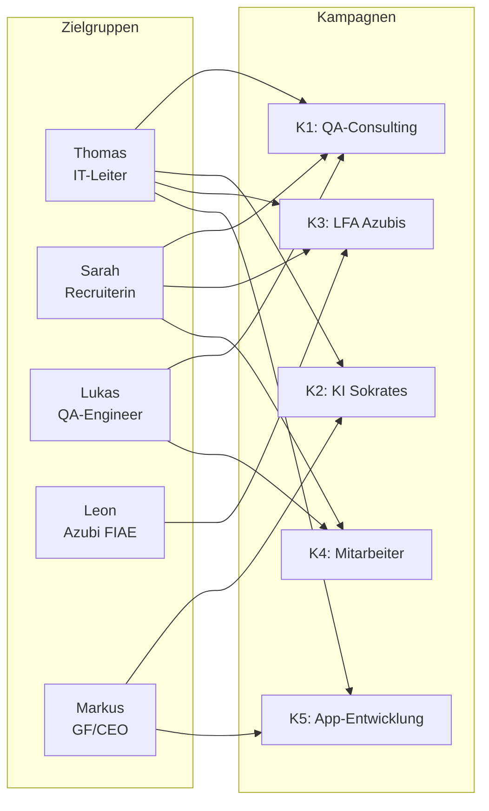
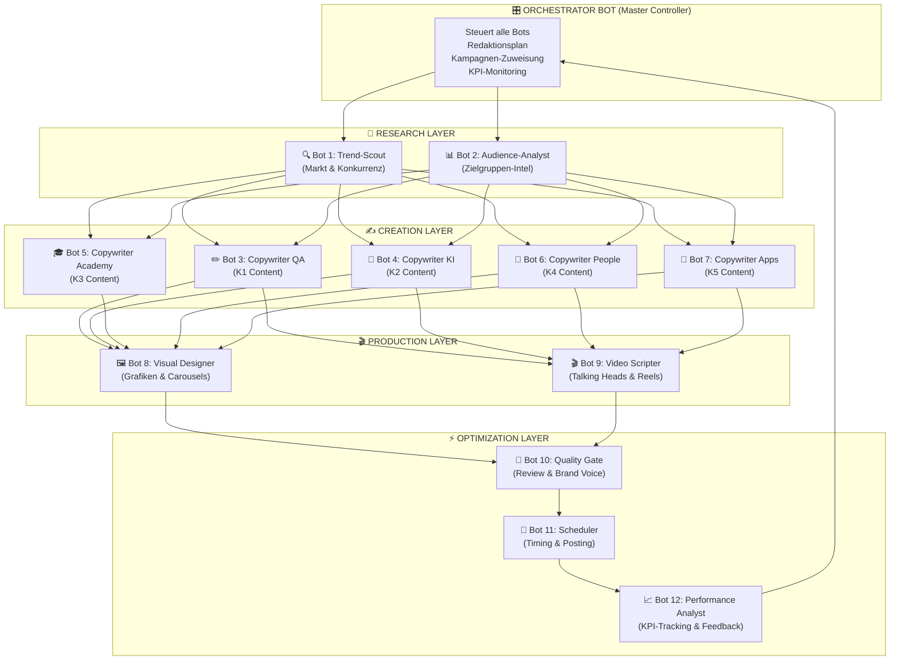
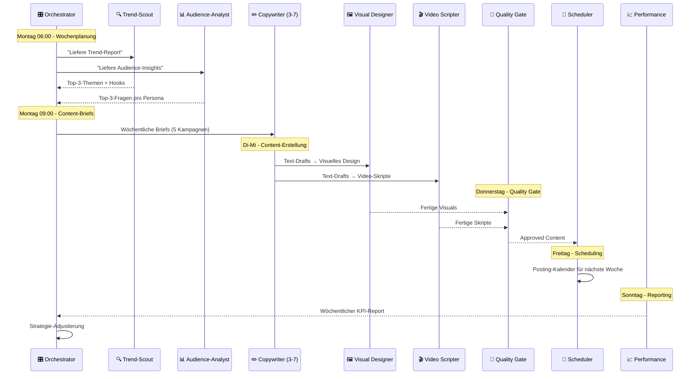

# WAMOCON Marketing-Maschine — Master-Strategie 2026/27

> **Version:** 1.0 | **Stand:** 27.06.2026  
> **Auftraggeber:** WAMOCON GmbH, Eschborn  
> **Strategie-Framework:** 80/20-Pareto × Top-5%-Performer-Konzepte  
> **Primärfokus:** Organische Reichweite

---

## 1. Ausgangslage & Datenbasis

### 1.1 Analysierte Dateien

| Datei | Typ | Kerninhalte |
|---|---|---|
| [kampagne_1_consulting_qa.json](Kampagnen/kampagne_1_consulting_qa.json) | Kampagne | QA-Consulting, ISTQB, Testautomatisierung — Budget 15.000 € |
| [kampagne_2_ki_sokrates.json](Kampagnen/kampagne_2_ki_sokrates.json) | Kampagne | KI-Projekt "Sokrates", Datensouveränität — Budget 25.000 € |
| [kampagne_3_lfa_azubis.json](Kampagnen/kampagne_3_lfa_azubis.json) | Kampagne | LFA-Ausbildungsplattform, Azubi-Recruiting — Budget 10.000 € |
| [kampagne_4_mitarbeiter.json](Kampagnen/kampagne_4_mitarbeiter.json) | Kampagne | Employer Branding, Team-Vorstellung — Budget 8.000 € |
| **Kampagne 5 (neu)** | Kampagne | App-Entwicklung (50+ Apps), maßgeschneidert — Budget TBD |
| [zielgruppe_1_itleiter.json](Zielgruppen/zielgruppe_1_itleiter.json) | Zielgruppe | "Thomas" — IT-Leiter/QA-Manager, 45-55, DACH |
| [zielgruppe_2_recruiterin.json](Zielgruppen/zielgruppe_2_recruiterin.json) | Zielgruppe | "Sarah" — HR-Managerin, 30-45, IT-Recruiting |
| [zielgruppe_3_qaengineer.json](Zielgruppen/zielgruppe_3_qaengineer.json) | Zielgruppe | "Lukas" — Test-Ingenieur, 25-35, Karrierepush |
| [zielgruppe_4_azubi_fiae.json](Zielgruppen/zielgruppe_4_azubi_fiae.json) | Zielgruppe | "Leon" — Schüler/Azubi, 16-22, FIAE-Ausbildung |
| [zielgruppe_5_b2b_ki.json](Zielgruppen/zielgruppe_5_b2b_ki.json) | Zielgruppe | "Markus" — GF/CEO Mittelstand, 45-60, KI-Investment |
| [wamocon.com/apps](https://www.wamocon.com/apps/) | Website | 50 Apps in 7 Kategorien — Proof of Execution |

### 1.2 Gesamtbudget aller Kampagnen

| Kampagne | Budget | Anteil |
|---|---|---|
| K1 — QA-Consulting | 15.000 € | 22% |
| K2 — KI Sokrates | 25.000 € | 36% |
| K3 — LFA Azubis | 10.000 € | 14% |
| K4 — Mitarbeiter | 8.000 € | 12% |
| K5 — App-Entwicklung | 11.000 € (Empfehlung) | 16% |
| **Gesamt** | **69.000 €** | 100% |

---

## 2. Audit: Zielgruppen × Kampagnen-Matrix

### 2.1 Zielgruppen-Kampagnen-Mapping (IST-Zustand)



### 2.2 Lücken-Analyse & Korrekturen

> [!IMPORTANT]
> **Identifizierte Gaps im aktuellen Mapping:**

| # | Befund | Handlungsempfehlung |
|---|---|---|
| 1 | **Zielgruppe 5 (GF Markus) fehlt in K1** | Ergänzen — Mittelstands-GFs beauftragen IT-Leiter mit QA-Dienstleister-Suche. K1-Content muss auch ROI/Business-Case-Sprache für C-Level enthalten. |
| 2 | **Zielgruppe 3 (Lukas) fehlt in K2** | Ergänzen — QA-Engineers sind die operativen Champions, die KI-Testtools einsetzen. Sokrates-Content muss auch den "Tool-User" Lukas abholen. |
| 3 | **Zielgruppe 2 (Sarah) fehlt in K2** | Bedingt ergänzen — Sarah sucht Fachkräfte. K2-Content kann sekundär zeigen, dass WAMOCON-Consultants KI-kompetent sind → erhöht ihren Vermittlungserfolg. |
| 4 | **Zielgruppe 5 (Markus) wird in K5 nicht adressiert** | **Kritisch** — Die 50 Apps sind der härteste Proof of Execution für B2B-KI-Kunden. K5-Content muss GFs zeigen: "Wir reden nicht über Software — wir liefern 50 Stück davon." |
| 5 | **Kampagne 4 (Mitarbeiter) spricht Zielgruppe 4 (Leon) nicht direkt an** | Ergänzen — Azubi-Interessenten wollen sehen, wie aktuelle Mitarbeiter arbeiten. K4-Content (Interviews) muss auch Azubi-Testimonials enthalten. |
| 6 | **Fehlende Zielgruppe: "COO/CDO mit Digitalisierungsdruck"** | Für K5 relevant — App-Entwicklung spricht nicht nur IT-Leiter, sondern auch digitalisierungstreibende C-Suite-Rollen an. Kann durch Erweiterung der Persona "Markus" abgedeckt werden. |

### 2.3 Korrigiertes Zielgruppen-Kampagnen-Mapping (SOLL)

| Zielgruppe | K1 QA | K2 Sokrates | K3 LFA | K4 Mitarbeiter | K5 Apps |
|---|:---:|:---:|:---:|:---:|:---:|
| Z1 Thomas (IT-Leiter) | ✅ Primär | ✅ Primär | ✅ B2B-LFA | ✅ Vertrauen | ✅ Primär |
| Z2 Sarah (Recruiterin) | ✅ Primär | ◐ Sekundär | ✅ Primär | ✅ Primär | ◌ Nicht aktiv |
| Z3 Lukas (QA-Engineer) | ✅ Primär | ✅ NEU ergänzt | ◌ Nicht aktiv | ✅ Primär | ◌ Nicht aktiv |
| Z4 Leon (Azubi) | ◌ Nicht aktiv | ◌ Nicht aktiv | ✅ Primär | ✅ NEU ergänzt | ◌ Nicht aktiv |
| Z5 Markus (GF/CEO) | ✅ NEU ergänzt | ✅ Primär | ◌ Nicht aktiv | ◌ Nicht aktiv | ✅ NEU ergänzt |

---

## 3. Kampagne 5 — App-Entwicklung: Neudefinition

> [!NOTE]
> Diese Kampagne existiert bisher nicht als JSON-Datei. Basierend auf der Analyse von [wamocon.com/apps](https://www.wamocon.com/apps/) und dem bestehenden Portfolio folgt hier die Kampagnen-Definition.

### 3.1 Kampagnen-Profil

```json
{
  "campaign": {
    "name": "Maßgeschneiderte App-Entwicklung (50+ Portfolio)",
    "status": "planned",
    "startDate": "2026-08-01",
    "endDate": "2027-01-31",
    "budget": 11000,
    "channels": ["LinkedIn", "Unternehmenswebsite", "Fachblogs", "YouTube"],
    "description": "Positionierung der WAMOCON als nachweislich produktiver App-Entwickler im DACH-Raum mit 50+ ausgelieferten Anwendungen. Fokus auf B2B-Kunden, die maßgeschneiderte Softwarelösungen für interne Prozesse, KI-Integration oder Kundeninteraktion benötigen. Der USP: Nicht nur Beratung, sondern nachweisliche Delivery — 50 Apps als Proof of Execution.",
    "masterPrompt": "Du agierst als Solution Architect und App-Stratege. Erstelle Content, der IT-Leiter und Geschäftsführer davon überzeugt, dass WAMOCON nicht nur über Software redet, sondern nachweislich liefert. Nutze das Portfolio von 50+ Apps als unwiderlegbaren Beweis. Fokussiere auf konkrete Use-Cases (Büro-Automatisierung, KI-gestützte Tools, Branchenlösungen). Betone: Schnelle Umsetzung, deutsche Entwicklung, Datensouveränität, individuelle Anpassung. Tonalität: Confident, ergebnisorientiert, mit konkreten Zahlen.",
    "targetAudiences": ["Z1 (Thomas)", "Z5 (Markus)"],
    "campaignKeywords": [
      "App-Entwicklung", "Maßgeschneiderte Software", "50 Apps",
      "KI-Apps", "Prozessdigitalisierung", "SaaS", "Branchenlösung",
      "Proof of Execution", "WAMOCON Portfolio"
    ]
  }
}
```

### 3.2 WAMOCON App-Portfolio — Strategische Kategorisierung für Marketing

| Kategorie | Anzahl | Highlight-Apps für Content | B2B-Relevanz |
|---|:---:|---|---|
| Office & Produktivität | 6 | BackupPilot, Anforderungsportal, Bedarfspilot | ⭐⭐⭐ Hoch |
| Marketing, Finanzen & Planung | 6 | Momentum Marketing, SchufaCleaner, BuyRight-AI | ⭐⭐ Mittel |
| KI, Analyse & Wachstum | 5 | KI Manager LMS, LFA, ProCon, Kompetenzkompass | ⭐⭐⭐ Hoch |
| Immobilien & Handwerk | 7 | Plan-it, Ustafix, Auktivo | ⭐⭐ Mittel |
| Mobilität, Familie & Recht | 9 | AWAY, TRACE, CarMan, BlitzerSafe | ⭐⭐ Mittel |
| Entwickler & Marktplatz | 2 | LocalForge, RegioSync | ⭐ Nische |
| Kommunikation & Lifestyle | 15 | KLAR, ARIA, Sirin, TeamRadar, AppLens | ⭐⭐⭐ Hoch |

---

## 4. Die Top-5%-Performer-Strategie (Organische Reichweite)

> [!TIP]
> **Pareto-Gesetz angewendet:** Wir investieren 80% unserer Content-Energie in die 20% der Formate, die nachweislich 80% der organischen Reichweite und des Engagements erzeugen. Konkret: Wir fokussieren auf die Top 5% — die absoluten Outperformer-Formate im B2B-DACH-Raum.

### 4.1 Die 5 Formate, die 80% der Reichweite generieren

| Rang | Format | Plattform | Warum Top 5% | Einsatz für WAMOCON |
|:---:|---|---|---|---|
| 1 | **Talking-Head-Videos (30-90s)** | LinkedIn, YouTube Shorts | Höchste organische Reichweite auf LinkedIn 2025/26. Algorithmus priorisiert Native-Video massiv. Benchmark: Tricentis CEO-Videos. | Hamza (GF) + Senior Consultants als Gesichter. 1 Pain-Point-Video pro Woche. |
| 2 | **PDF-Carousels (8-12 Slides)** | LinkedIn | Zweitbestes Format für Engagement-Rate (Swipes = Dwell Time = Algorithmus-Boost). Benchmark: QualityMinds, imbus AG Wissensposts. | Wöchentliche Fach-Carousels mit Frameworks, Checklisten, Vergleiche. |
| 3 | **Kontroverse Text-Posts (POV-Format)** | LinkedIn | "Hot Takes" generieren Kommentare → Algorithmus-Gold. Benchmark: Mindsquare Personal-Branding. | Positionierung zu KI-Hype, Testing-Mythen, ISTQB-Debatte. 2x/Woche. |
| 4 | **"Day in the Life"-Reels** | Instagram, TikTok | Für Azubi-Recruiting und Employer Branding mit Abstand das performanteste Format bei Gen Z. | Leon-Zielgruppe: Authentische Azubi-Einblicke, Code-Sessions, Mentoring. |
| 5 | **Thread-Posts (Story-Arc)** | LinkedIn | Lange Threads mit Storytelling (Projekt-Fallstudien) halten Nutzer auf der Plattform → starke Reichweite. | Case Studies: "Wie wir App X in 6 Wochen gebaut haben" — K5-Goldmine. |

### 4.2 Die Formate, die wir NICHT priorisieren (Bottom 80%)

| Format | Warum nicht priorisiert |
|---|---|
| Klassische Blogposts (1500+ Wörter) | Zu langsam, zu wenig Distribution ohne SEO-Invest. Nur als "Repurpose-Ziel" nutzen. |
| Newsletter (alleinstehend) | Erst ab 2.000+ Subscriber relevant. Aktuell als Sekundärkanal. |
| Podcasts | Extrem hoher Produktionsaufwand, langsamer Audience-Aufbau. Nicht im 80/20. |
| LinkedIn Articles | Nahezu keine organische Reichweite mehr. Vom Algorithmus abgestraft. |
| Statische Bilderpostings | Niedrigstes Engagement auf LinkedIn. Nur als Ergänzung. |

### 4.3 Reverse-Engineering: Erfolgreiche Hooks der Top-Performer

> [!IMPORTANT]
> **Hook = Alles.** Die ersten 2 Zeilen entscheiden über 90% der Performance eines Posts. Hier die validierten Hook-Strukturen der WAMOCON-Konkurrenten:

| Hook-Typ | Struktur | Benchmark-Quelle | WAMOCON-Beispiel |
|---|---|---|---|
| **Kontra-Intuition** | "Die meisten [Rolle] machen [X] falsch." | Tricentis (Testautomatisierung) | "Die meisten IT-Leiter automatisieren ihre Tests falsch. Hier ist warum." |
| **Zahlen-Schock** | "[Zahl]% der [X] scheitern an [Y]." | imbus AG (Studienzitate) | "73% aller SAP-Migrationen überschreiten ihr Budget. Der wahre Grund sitzt im Testing." |
| **Verbotenes Wissen** | "Was Ihnen Ihr [Rolle/Dienstleister] nie sagt:" | QualityMinds (Testing-Insights) | "Was Ihnen Ihr Testautomatisierungs-Anbieter nie sagt: Automatisierung ≠ Qualität." |
| **Persönliche Offenbarung** | "In [X] Jahren als [Rolle] habe ich [Erkenntnis]." | Mindsquare (Founder-Storytelling) | "In 10 Jahren als Testmanager habe ich einen Fehler immer wieder gesehen." |
| **Direkte Provokation** | "[Kontroverse These]. Und hier ist der Beweis." | Expleo Group (Thought Leadership) | "ISTQB-Zertifizierungen sind überbewertet. Fight me. (Aber lest erst meine Begründung.)" |
| **Before/After** | "Vorher: [Pain]. Nachher: [Lösung]." | andagon GmbH (Projektberichte) | "Vorher: 3 Wochen Regressionstest. Nachher: 4 Stunden. Was wir geändert haben:" |

---

## 5. Bot-Architektur: Die WAMOCON Marketing-Maschine

> [!IMPORTANT]
> **Kernidee:** Ein Ökosystem spezialisierter KI-Bots (Agenten), die jeweils einen eng definierten Aufgabenbereich der Content-Produktion und -Distribution abdecken. Kein "One-Prompt-Does-All" — stattdessen eine Pipeline von Spezialisten.

### 5.1 Architektur-Übersicht



### 5.2 Bot-Spezifikationen

---

#### 🎛️ Bot 0: ORCHESTRATOR (Master Controller)

| Eigenschaft | Wert |
|---|---|
| **Aufgabe** | Zentrale Steuerung aller Bots. Verwaltet den Redaktionskalender, weist Kampagnen zu, priorisiert Content-Aufträge basierend auf KPIs und Saisonalität. |
| **Input** | Redaktionskalender, KPI-Dashboard (Bot 12), Kampagnen-Definitionen (K1–K5), Zielgruppen-Profile (Z1–Z5) |
| **Output** | Tägliche/wöchentliche Content-Briefs an Creation-Layer-Bots, Priorisierungs-Entscheidungen, Eskalationen |
| **Trigger** | Montags 06:00 (Wochenplanung), täglich 08:00 (Tages-Briefing), Ad-hoc bei KPI-Alerts |
| **Kern-Prompt-Direktive** | "Du bist der strategische Kopf der WAMOCON Marketing-Maschine. Du kennst alle 5 Kampagnen, alle 5 Zielgruppen und den Redaktionskalender. Deine Aufgabe: Priorisiere die Content-Produktion nach dem Pareto-Prinzip. Kampagnen mit höchstem ROI-Potenzial zuerst. Vermeide Übersättigung eines einzelnen Kanals. Stelle sicher, dass jede Zielgruppe mindestens 2x/Woche relevanten Content erhält." |

---

#### 🔍 Bot 1: TREND-SCOUT (Markt & Konkurrenz)

| Eigenschaft | Wert |
|---|---|
| **Aufgabe** | Tägliches Monitoring der Top-10-Konkurrenten (imbus, Qytera, QualityMinds, Tricentis, Expleo, trendig, andagon, Proficom, Mindsquare, infoteam) auf LinkedIn, deren Websites und in Branchenmedien. Identifikation von Trendthemen, erfolgreichen Post-Formaten und Content-Lücken. |
| **Input** | Konkurrenz-URLs, LinkedIn-Profile, Branchennews-Feeds (heise, Golem, CIO Magazin) |
| **Output** | Wöchentlicher Trend-Report: Top-3-Themen, Top-3-Hooks, Content-Gaps, "Steal-Worthy"-Formate |
| **Kern-Prompt-Direktive** | "Du bist ein Competitive Intelligence Analyst für den B2B-IT-Markt im DACH-Raum. Analysiere wöchentlich die LinkedIn-Aktivitäten und Website-Inhalte der Konkurrenten. Identifiziere: (1) Posts mit überdurchschnittlichem Engagement (>50 Likes, >10 Kommentare), (2) Wiederkehrende Themen, (3) Content-Lücken, die WAMOCON besetzen kann. Liefere 3 konkrete Content-Impulse mit Hook-Vorschlag." |

---

#### 📊 Bot 2: AUDIENCE-ANALYST (Zielgruppen-Intel)

| Eigenschaft | Wert |
|---|---|
| **Aufgabe** | Analyse des Zielgruppenverhaltens: Welche WAMOCON-Posts performen bei welcher Persona? Welche Fragen stellt die Zielgruppe in Kommentaren, Foren (Reddit, heise), auf Konferenzen? Feedback-Loop zurück an Orchestrator. |
| **Input** | WAMOCON-Social-Media-Analytics, Zielgruppen-JSONs (Z1–Z5), Community-Kommentare, Google Trends DACH |
| **Output** | Monatliches Audience-Insight-Briefing pro Zielgruppe, Content-Demand-Score |
| **Kern-Prompt-Direktive** | "Du analysierst, was die 5 WAMOCON-Zielgruppen (IT-Leiter Thomas, Recruiterin Sarah, QA-Engineer Lukas, Azubi Leon, GF Markus) tatsächlich bewegt. Nutze deren dokumentierte Pain Points und Goals. Identifiziere die 3 brennendsten Fragen pro Persona für die kommende Woche. Priorisiere nach: Schmerzintensität × Lösungskompetenz WAMOCONs." |

---

#### ✏️ Bot 3: COPYWRITER QA (Kampagne 1 — Consulting)

| Eigenschaft | Wert |
|---|---|
| **Aufgabe** | Erstellung aller Content-Pieces für Kampagne 1: QA-Consulting, Testmanagement, ISTQB, SAP-Testing. Formate: LinkedIn-Posts, Carousels, Blog-Entwürfe. |
| **Zielgruppen** | Z1 (Thomas), Z2 (Sarah), Z3 (Lukas), Z5 (Markus — NEU) |
| **Kanäle** | LinkedIn (Primär), Fach-Blogs, Newsletter |
| **Tonalität** | Senior QA-Experte auf Augenhöhe mit IT-Leitern. Fachlich fundiert, lösungsorientiert, interaktiv. ISTQB-Terminologie sicher einsetzen. |
| **Kern-Prompt-Direktive** | "Du bist ein Senior QA-Consultant bei WAMOCON mit 15+ Jahren Erfahrung in Testmanagement, ISTQB-Methodik, SAP-Testing und Testautomatisierung. Erstelle fachlich tiefgehende LinkedIn-Inhalte. Deine Inhalte müssen so präzise sein, dass ein ISTQB-zertifizierter Testmanager sie ohne Einwände teilen würde. Adressiere die Pain Points: Fachkräftemangel, Zeitdruck bei Releases, fehlende Testkonzepte bei SAP-Migrationen. Jeder Post endet mit einer echten Frage an die Community, die Diskussion auslöst. Vermeide: Generisches Marketing-Deutsch, oberflächliche Ratschläge, Hype ohne Substanz." |
| **Wöchentliche Output-Vorgabe** | 2 LinkedIn-Posts (Text), 1 Carousel, 1 Blog-Entwurf/Monat |

---

#### 🤖 Bot 4: COPYWRITER KI (Kampagne 2 — Sokrates)

| Eigenschaft | Wert |
|---|---|
| **Aufgabe** | Content rund um KI-Projekt "Sokrates", Prozessautomatisierung, Datensouveränität, LLM-as-a-Judge, sichere Unternehmens-KI. |
| **Zielgruppen** | Z5 (Markus — GF/CEO), Z1 (Thomas — IT-Leiter), Z3 (Lukas — NEU ergänzt) |
| **Kanäle** | LinkedIn (Primär), Wirtschaftsmagazine-Pitches, B2B-Direct-Mailing-Vorlagen |
| **Tonalität** | Visionär, aber geerdet. ROI-fokussiert. Sicherheits- und Datenschutz-bewusst. Keine KI-Buzzwords ohne Substanz. |
| **Kern-Prompt-Direktive** | "Du bist ein KI-Stratege und Digitalisierungsexperte, der Geschäftsführer und IT-Leiter im deutschen Mittelstand berät. Dein Fokus: Das WAMOCON-Projekt 'Sokrates' — maßgeschneiderte KI-Lösungen, bei denen die Datenhoheit zu 100% beim Kunden bleibt (kein Abfluss an OpenAI/Google). Jeder Content-Piece muss einen greifbaren ROI-Bezug enthalten (Zeitersparnis in Stunden, Kostenreduktion in %, Produktivitätssteigerung). Adressiere die Skepsis: KI-Hype, Halluzinationen, DSGVO-Risiken. Dein Gegenmittel: Transparenz, PoCs, deutsche Server. Für Lukas (QA-Engineer): Zeige, wie KI das tägliche Testing-Handwerk verbessert (Testfall-Generierung, Anomalie-Erkennung)." |
| **Wöchentliche Output-Vorgabe** | 2 LinkedIn-Posts, 1 Carousel, 1 Fallstudie/Quartal |

---

#### 🎓 Bot 5: COPYWRITER ACADEMY (Kampagne 3 — LFA)

| Eigenschaft | Wert |
|---|---|
| **Aufgabe** | Dual-Tonalität: B2C-Content für Azubis (TikTok, Instagram) + B2B-Content für HR/Ausbilder (LinkedIn). Promotion des LFA-Systems als SaaS-Lösung. |
| **Zielgruppen** | Z4 (Leon — Azubi, Primär), Z1 (Thomas — B2B-LFA-Verkauf), Z2 (Sarah — Recruiting) |
| **Kanäle** | Instagram + TikTok (B2C), LinkedIn (B2B) |
| **Tonalität B2C** | Authentisch, locker, auf Augenhöhe mit Gen Z. Duz-Kultur. Keine Konzern-Sprache. Emojis erlaubt, aber nicht übertrieben. |
| **Tonalität B2B** | Professionell, nutzenorientiert. LFA als EdTech-Produkt positionieren, das Ausbilder entlastet. |
| **Kern-Prompt-Direktive** | "Du erstellst Content in ZWEI komplett unterschiedlichen Modi: [MODUS A — B2C / Gen Z]: Schreibe Captions für Instagram Reels und TikTok-Videos, die 16-22-Jährige ansprechen. Zeige echte Einblicke: Coding-Sessions, erste eigene Apps, Mentoring-Momente, Team-Lunch, coole Hardware. WAMOCON soll sich anfühlen wie das Tech-Startup, bei dem man seinen Traumjob startet. Vermeide: HR-Floskeln wie 'Wir suchen motivierte Teamplayer'. [MODUS B — B2B / LinkedIn]: Positioniere das 'LFA' (Lernzentrum Für Azubis) als innovative SaaS-Plattform für IT-Ausbildungsbetriebe. Betone: Zeitersparnis für Ausbilder, strukturierte Lerninhalte, FIAE-Prüfungsvorbereitung, digitale Fortschrittskontrolle. Ziel: LFA an andere Unternehmen verkaufen." |
| **Wöchentliche Output-Vorgabe** | 3 Reels/TikToks (B2C), 1 LinkedIn-Post (B2B), 1 Story-Strecke |

---

#### 👥 Bot 6: COPYWRITER PEOPLE (Kampagne 4 — Mitarbeiter)

| Eigenschaft | Wert |
|---|---|
| **Aufgabe** | Employer Branding Content: Mitarbeiter-Interviews, Behind the Scenes, Team-Events, Azubi-Testimonials (NEU), Erfolgsgeschichten. |
| **Zielgruppen** | Z3 (Lukas — Talent-Gewinnung), Z2 (Sarah — Recruiting-Support), Z1 (Thomas — Vertrauensaufbau), Z4 (Leon — NEU ergänzt) |
| **Kanäle** | LinkedIn, Instagram, YouTube (Interviews), Karriere-Website |
| **Tonalität** | Extrem authentisch, menschlich, wertschätzend. Null Stockfoto-Energie. Die versteckte Botschaft: "Das sind die brillanten, aber nahbaren Menschen, mit denen Sie zusammenarbeiten." |
| **Kern-Prompt-Direktive** | "Du bist ein Employer Branding und Corporate Communications Experte. Erstelle sehr persönliche, menschliche Beiträge, die das WAMOCON-Team vorstellen. Entwickle Interviewfragen, erzähle Erfolgsgeschichten, zeige Büro-Alltag und Team-Events. NEU: Integriere explizit Azubi-Stimmen (Leon-Persona). Zeige den Weg vom Azubi-Tag-1 (aufgeregt, unsicher) bis zur ersten selbst gebauten App. DUAL-ZIEL: (1) Recruiting: 'Das ist das Team, zu dem du gehören solltest.' (2) Consulting-Vertrieb: 'Das sind die Experten, die Ihr Projekt retten.' Jeder Post muss eine echte Person zeigen — Name, Rolle, echtes Zitat." |
| **Wöchentliche Output-Vorgabe** | 1 Interview-Post, 1 Behind-the-Scenes, 1 Team-Moment |

---

#### 📱 Bot 7: COPYWRITER APPS (Kampagne 5 — App-Entwicklung)

| Eigenschaft | Wert |
|---|---|
| **Aufgabe** | Content rund um das 50-Apps-Portfolio: Case Studies, "Build in Public"-Stories, App-Spotlights, Kundenreferenzen, Technologie-Deep-Dives. |
| **Zielgruppen** | Z1 (Thomas — Softwarebedarf), Z5 (Markus — Digitalisierungspartner) |
| **Kanäle** | LinkedIn (Primär), YouTube (App-Demos), Unternehmenswebsite |
| **Tonalität** | Confident, ergebnisorientiert, mit konkreten Zahlen. "Wir haben geliefert. 50 Mal." |
| **Kern-Prompt-Direktive** | "Du bist ein Solution Architect und Software-Unternehmer. WAMOCON hat nachweislich 50+ Apps in 7 Kategorien entwickelt und ausgeliefert: Office, Marketing, KI, Immobilien, Mobilität, Entwickler-Tools, Lifestyle. Dein Content muss diesen 'Proof of Execution' als stärksten Differentiator im DACH-Markt positionieren. FORMATE: (1) App-Spotlight (1 App/Woche mit Problem → Lösung → Ergebnis), (2) 'How We Built It'-Threads (Technologie-Stack, Herausforderungen, Learnings), (3) Vergleich 'Eigenentwicklung vs. WAMOCON' (Kosten, Zeit, Qualität). Highlight-Apps für den Start: ARIA (Arztpraxis-KI), Plan-it (Architekturplaner), KLAR (Content-Prüfung), LFA (EdTech), BackupPilot, Momentum Marketing. Nutze Zahlen: '50 Apps. 7 Kategorien. 1 Team aus Eschborn.'" |
| **Wöchentliche Output-Vorgabe** | 1 App-Spotlight, 1 "Build-Story"-Thread, 1 Portfolio-Carousel/Monat |

---

#### 🖼️ Bot 8: VISUAL DESIGNER

| Eigenschaft | Wert |
|---|---|
| **Aufgabe** | Erstellung aller visuellen Assets: LinkedIn-Carousel-Slides, Instagram-Post-Grafiken, Story-Templates, Thumbnail-Designs, Infografiken. |
| **Input** | Fertige Texte von Bots 3–7, Brand-Guidelines (Farben, Fonts, Logo) |
| **Output** | Print-ready Visuals (PNG/PDF), Carousel-Decks, Story-Templates |
| **Kern-Prompt-Direktive** | "Du bist ein B2B Visual Designer, spezialisiert auf LinkedIn-Carousels und Social-Media-Grafiken. Dein Design-System: WAMOCON Corporate Identity (dunkle Grundtöne, Akzentfarbe aus dem WAMOCON-CI, Poppins-Font). Jedes Carousel folgt dieser Struktur: Slide 1 = Hook (große Schrift, maximal 8 Wörter), Slides 2-9 = Content (1 Kernaussage pro Slide, einfache Visualisierungen), Letzte Slide = CTA + WAMOCON-Logo. Regeln: Keine Stockfotos. Klare Hierarchien. Viel Whitespace. Lesbar auf Mobile (Mindestschriftgröße 24pt)." |

---

#### 🎬 Bot 9: VIDEO SCRIPTER

| Eigenschaft | Wert |
|---|---|
| **Aufgabe** | Erstellung vollständiger Video-Skripte für: LinkedIn Talking-Head-Videos (30-90s), Instagram/TikTok Reels, YouTube-Kurzvideos, App-Demo-Skripte. |
| **Input** | Content-Briefs von Bots 3–7, Speaker-Profil (Hamza, Senior Consultants, Azubis) |
| **Output** | Shot-genaue Skripte mit: Sprechertext, Timecodes, B-Roll-Anweisungen, Musik/SFX-Cues, CTA |
| **Kern-Prompt-Direktive** | "Du schreibst Video-Skripte, die fesseln. REGELN: (1) Die ersten 3 Sekunden entscheiden — starte mit einem HOOK, niemals mit 'Hallo, ich bin...'. (2) Ein Gedanke pro Satz. (3) Sprechsprache, nicht Schriftsprache. (4) Jedes Video hat exakt eine Kernbotschaft. (5) CTA in den letzten 5 Sekunden — klar und direkt. FORMATE: [TALKING HEAD] = 1 Kamera, direkter Blickkontakt, B-Roll-Schnitte alle 8-12s. [REEL] = Schnelle Schnitte, Text-Overlays, Trending-Audio-Empfehlung. [APP-DEMO] = Screen-Recording + Voiceover, maximal 60s." |

---

#### 📝 Bot 10: QUALITY GATE (Review & Brand Voice)

| Eigenschaft | Wert |
|---|---|
| **Aufgabe** | Letzte Qualitätskontrolle ALLER Content-Pieces vor Veröffentlichung. Prüft: Brand Voice, Tonalität, Factual Accuracy, Zielgruppen-Fit, Compliance (DSGVO-Hinweise, Disclaimer), Rechtschreibung. |
| **Input** | Fertige Content-Pieces von Bots 8 + 9 |
| **Output** | Approval/Revision mit konkreten Änderungsvorschlägen, Brand-Score (0-100) |
| **Kern-Prompt-Direktive** | "Du bist der letzte Qualitätscheck vor der Veröffentlichung. Prüfe jeden Content anhand dieser Checkliste: ☐ Tonalität passt zur Zielgruppe (B2B ≠ B2C-Sprache) ☐ Keine generischen Marketing-Floskeln ('innovative Lösungen', 'synergetisch', 'state of the art' ohne Kontext) ☐ Mindestens 1 konkretes Beispiel/Zahl pro Post ☐ CTA ist klar und actionable ☐ WAMOCON-USPs sind subtil, aber präsent ☐ Keine rechtlich bedenklichen Aussagen (garantierte Ergebnisse etc.) ☐ Hook ist in den ersten 2 Zeilen ☐ Post ist mobil-optimiert (kurze Absätze, Zeilenumbrüche) Gib einen Brand-Score von 0-100 und konkrete Revision-Notes." |

---

#### 📅 Bot 11: SCHEDULER (Timing & Distribution)

| Eigenschaft | Wert |
|---|---|
| **Aufgabe** | Bestimmung der optimalen Posting-Zeiten pro Plattform und Zielgruppe. Verwaltung des Publishing-Kalenders. Sicherstellung der Content-Kadenz ohne Übersättigung. |
| **Input** | Approved Content von Bot 10, Analytics-Daten von Bot 12, Plattform-Best-Practices |
| **Output** | Posting-Kalender mit exakten Zeiten, Cross-Posting-Plan, Repurpose-Schedule |
| **Optimale Posting-Zeiten (DACH B2B)** | **LinkedIn:** Di-Do, 07:30-08:30 und 12:00-13:00. **Instagram:** Mo-Fr, 11:00-13:00 und 18:00-20:00. **TikTok:** Mo-Sa, 18:00-21:00. |
| **Posting-Kadenz-Regeln** | LinkedIn: Max 1 Post/Tag, 5/Woche. Instagram: 1 Feed-Post + 3 Stories/Tag. TikTok: 3-5 Reels/Woche. YouTube: 1 Video/Woche. |

---

#### 📈 Bot 12: PERFORMANCE ANALYST (KPI & Feedback-Loop)

| Eigenschaft | Wert |
|---|---|
| **Aufgabe** | Tracking aller KPIs, Erstellung von Performance-Reports, Identifikation von Top-Performern und Underperformern, datengetriebene Optimierungsempfehlungen. Feedback-Loop zurück an Orchestrator. |
| **Input** | Plattform-Analytics (LinkedIn, Instagram, TikTok, YouTube), CRM-Daten, Website-Traffic |
| **Output** | Wöchentlicher KPI-Report, monatlicher Strategy-Review, Echtzeit-Alerts bei Viral-Content |
| **KPI-Framework** | Siehe Tabelle unten |

**KPI-Tracking-Matrix:**

| KPI | Ziel Q3 2026 | Ziel Q4 2026 | Messung |
|---|---|---|---|
| LinkedIn Follower | +500 | +1.500 | Wöchentlich |
| LinkedIn Post-Engagement-Rate | >3% | >4.5% | Pro Post |
| Instagram Follower (Academy) | +300 | +1.000 | Wöchentlich |
| TikTok Views/Reel (Durchschnitt) | 1.000 | 5.000 | Pro Reel |
| Website-Traffic (organisch) | +30% | +60% | Monatlich |
| Inbound-Leads (Kontaktanfragen) | 5/Monat | 15/Monat | Monatlich |
| Content-Output (Posts gesamt) | 40/Monat | 50/Monat | Wöchentlich |
| Carousel-Save-Rate (LinkedIn) | >2% | >4% | Pro Post |
| Video-Completion-Rate | >40% | >55% | Pro Video |

---

## 6. Content-Pipeline: Wöchentlicher Flow



---

## 7. Kampagnen-spezifische Content-Kalender (Beispielwoche)

| Tag | LinkedIn | Instagram | TikTok | YouTube |
|---|---|---|---|---|
| **Montag** | K1: QA-Carousel "5 Test-Anti-Patterns" | K3: Story "Code & Coffee mit Azubi Max" | K3: Reel "POV: Dein erster Tag als FIAE-Azubi" | — |
| **Dienstag** | K2: Sokrates-Post "Warum Ihr ChatGPT-Einsatz ein Datenschutz-Risiko ist" | K4: Team-Spotlight (Mitarbeiter-Portrait) | — | — |
| **Mittwoch** | K5: App-Spotlight "Wie ARIA Arztpraxen 3h/Tag spart" | K3: Reel "Behind the Scenes: Coding-Session" | K3: Reel "Was verdient ein Azubi wirklich?" | K5: App-Demo "KLAR — Content-Prüfung in 60s" |
| **Donnerstag** | K4: Talking-Head-Video "Warum ich bei WAMOCON geblieben bin" | K4: Story "Team-Event Recap" | K3: Reel "Erwartung vs. Realität: IT-Ausbildung" | — |
| **Freitag** | K1: Kontroverse "Manuelles Testing ist nicht tot. Aber..." | K3: Carousel "5 Skills, die kein Azubi lernt" | — | — |

---

## 8. Cross-Kampagnen-Synergien (Multiplikator-Effekte)

> [!TIP]
> **Jeder Content-Piece sollte mindestens 2 Kampagnen gleichzeitig bedienen.** Das ist der wahre 80/20-Hebel.

| Synergie-Typ | Beispiel | Beteiligte Kampagnen |
|---|---|---|
| **QA + KI** | "Wie KI das SAP-Testing revolutioniert (Sokrates in Aktion)" | K1 + K2 |
| **Apps + KI** | "App-Spotlight: KLAR prüft Content auf KI-Halluzinationen" | K5 + K2 |
| **Mitarbeiter + Academy** | "Interview: Azubi Tim erzählt von seinem Weg zum Junior-Dev" | K4 + K3 |
| **Apps + QA** | "Wie wir unsere eigenen 50 Apps testen (Eating our own Dogfood)" | K5 + K1 |
| **KI + Apps** | "50 Apps mit KI-Features: WAMOCONs Proof of Execution" | K2 + K5 |
| **Academy + Apps** | "Unsere Azubis haben diese 3 Apps mitgebaut" | K3 + K5 |

---

## 9. Repurpose-Matrix (1 Content → 7 Formate)

> [!NOTE]
> Ein einziger hochwertiger Inhalt (z.B. eine Fallstudie) wird systematisch in 7 Formate umgewandelt. Das ist der Kern der Content-Maschine.

```
📄 Fallstudie (K5: "Wie wir ARIA in 8 Wochen gebaut haben")
 │
 ├── 📊 LinkedIn-Carousel (8 Slides: Problem → Stack → Lösung → Ergebnis)
 ├── 🎬 Talking-Head-Video (60s: Entwickler erzählt die Story)
 ├── 🐦 LinkedIn-Thread (7 Posts: Chronologischer Build-Story-Arc)
 ├── 📸 Instagram-Reel (30s: Schnelle Cuts mit Codezeilen + fertige App)
 ├── 📝 Blog-Artikel (1200 Wörter: SEO-optimiert für "App-Entwicklung Eschborn")
 ├── 📧 Newsletter-Snippet (200 Wörter + CTA zum vollständigen Artikel)
 └── 💬 Kommentar-Teaser (3 Sätze unter einem fremden LinkedIn-Post zum Thema)
```

---

## 10. Technologie-Stack-Empfehlung

| Komponente | Tool-Empfehlung | Zweck |
|---|---|---|
| **Bot-Orchestrierung** | n8n (Self-hosted) oder Make.com | Workflow-Automatisierung, Bot-Verkettung |
| **LLM-Backbone** | Claude Opus / GPT-4o (via API) | Content-Generierung für Bots 3–7 |
| **Prompt-Management** | ProCon (WAMOCON-eigene App!) | Versionierung aller Bot-Prompts |
| **Social Scheduling** | Buffer / Publer / Metricool | Plattformübergreifendes Posting |
| **Design** | Canva Pro (Carousel-Templates) | Visuelle Assets, Templates |
| **Video** | CapCut / Descript | Video-Editing, Subtitles, B-Roll |
| **Analytics** | Shield (LinkedIn), Metricool (Multi) | KPI-Tracking, Reporting |
| **CRM / Leads** | HubSpot Free / Momentum Marketing | Lead-Erfassung, Nurturing |
| **Monitoring** | Brand24 / Mention | Konkurrenz- und Marken-Monitoring |

---

## 11. Priorisierung: Die ersten 30 Tage

> [!IMPORTANT]
> **Quick Wins zuerst.** In den ersten 30 Tagen konzentrieren wir uns auf die Maßnahmen mit dem höchsten Impact bei geringstem Setup-Aufwand.

| Woche | Fokus | Deliverables |
|---|---|---|
| **Woche 1** | Orchestrator + Copywriter-Bots einrichten | Bot-Prompts finalisieren, Templates erstellen, Brand Voice Guide |
| **Woche 2** | Erste Content-Welle LinkedIn (K1 + K2) | 5 LinkedIn-Posts, 2 Carousels, 1 Talking-Head-Skript |
| **Woche 3** | Instagram/TikTok Launch (K3 + K4) | 3 Reels, 2 Stories, 1 Mitarbeiter-Interview |
| **Woche 4** | Kampagne 5 Launch + Performance-Review | 2 App-Spotlights, 1 Portfolio-Carousel, Erster KPI-Report |

---

## 12. Governance & Eskalation

| Szenario | Handlung |
|---|---|
| Post mit Brand-Score < 70 | Automatische Revision durch Bot 10, kein Posting ohne Re-Approval |
| KPI-Ziel um > 30% verfehlt | Bot 12 eskaliert an Orchestrator → Format-Wechsel oder Themen-Pivot |
| Viraler Post (> 10x Durchschnitt) | Bot 12 Alert → Orchestrator priorisiert Follow-Up-Content innerhalb 24h |
| Negatives Community-Feedback | Bot 10 prüft sofort, Orchestrator entscheidet: Antwort, Edit oder Delete |
| Neue Kampagne/Zielgruppe | Orchestrator erstellt neuen Bot oder erweitert bestehenden Copywriter-Bot |

---

## 13. Offene Punkte / User Review

> [!WARNING]
> **Folgende Punkte erfordern deine Entscheidung, bevor wir in die Umsetzung gehen:**

1. **Budget Kampagne 5:** Ich habe 11.000 € vorgeschlagen (16% des Gesamtbudgets). Passt das, oder soll der Anteil höher/niedriger sein?

2. **Sprecher für Talking-Head-Videos:** Wer sind die 2-3 Personen, die als "Gesichter" der WAMOCON vor der Kamera stehen? (GF Hamza? Senior Consultants? Azubis?)

3. **PDF-Strategie-Dokument:** Die PDF-Datei konnte ich nicht direkt einlesen (Binärformat). Falls dort Inhalte stehen, die meine Analyse ergänzen oder korrigieren, bitte als Text/JSON bereitstellen oder die Kernpunkte zusammenfassen.

4. **Kampagne-5-JSON:** Soll ich die oben definierte Kampagne 5 als [kampagne_5_app_entwicklung.json](Kampagnen/kampagne_5_app_entwicklung.json) in das Projekt schreiben?

5. **Zielgruppen-Erweiterung:** Fehlt eine 6. Zielgruppe (z.B. "CDO/COO mit Digitalisierungsauftrag" als Käufer für K5)?

6. **Tool-Entscheidungen:** Welchen Tech-Stack nutzt ihr bereits für Social Media (Scheduling, Design, Analytics)? Das beeinflusst die Bot-Konfiguration.

---

*Dieses Dokument ist die strategische Grundlage für die gesamte WAMOCON Marketing-Maschine. Jede Entscheidung basiert auf der Analyse der 4 Kampagnen-JSONs, 5 Zielgruppen-JSONs, des 50-Apps-Portfolios (wamocon.com/apps) und dem Reverse-Engineering der Top-10-Konkurrenten im DACH-Raum.*
